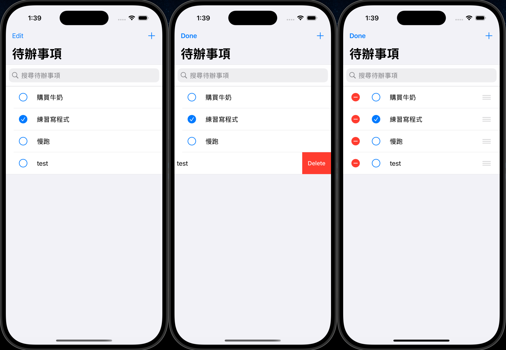
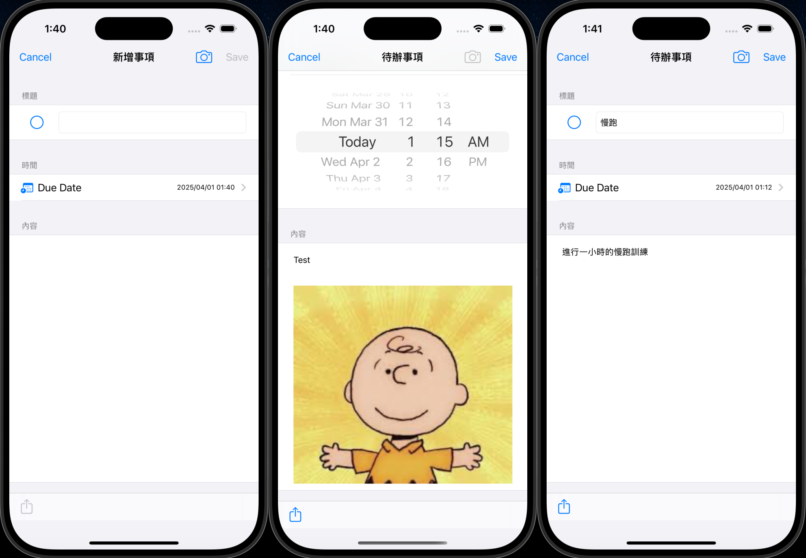
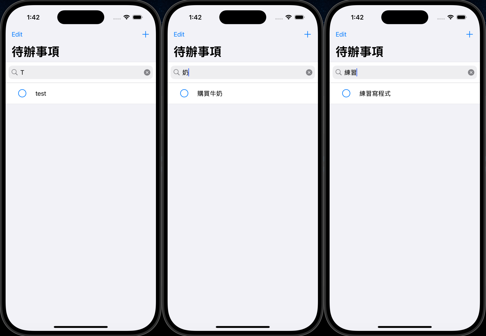
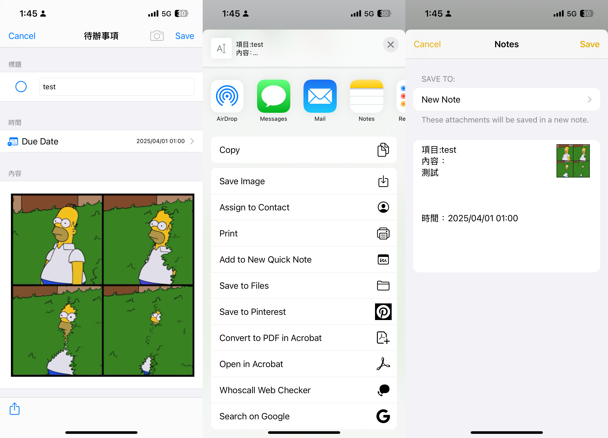

# 📝 HW_ToDoList

一個使用 UIKit 實作的待辦事項管理 App。支援新增、編輯、刪除、搜尋待辦事項，並可添加圖片與截止日期。

本專案為學習 iOS 開發時的練習作品，採用 MVC 架構與本地資料儲存，並搭配 Medium 文章詳細記錄開發過程與設計思維。

---

## 🔧 專案技術

- Swift 5
- UIKit + Storyboard
- UITableView + UISearchBar
- UIImagePickerController：支援相機 / 相簿選取
- UIDatePicker：設定截止日期
- FileManager + PropertyListEncoder/Decoder：圖片與資料本地儲存
- MVC 架構實作

---

## 📱 功能介紹

- ✅ 顯示所有待辦事項清單
- ✅ 新增 / 編輯待辦事項
- ✅ 設定截止日期（Date Picker）
- ✅ 拍照或選取圖片，插入到事項中
- ✅ 勾選完成與未完成狀態
- ✅ 搜尋待辦事項標題
- ✅ 分享事項內容與圖片
- ✅ 拖曳排序 / 滑動刪除
- ✅ 使用者操作時自動儲存與載入

---

## 🗂 專案結構

```
HW_ToDoList/
├── Models/
│   └── ToDoItem.swift                  // 資料模型
│ 
├── Managers/
│   ├── ImageStorageManager.swift       // 圖片儲存管理
│   └── ToDoItemManager.swift           // 資料儲存管理
│ 
├── Views/
│   └── ToDoListTableViewCell.swift     // 自定義 Cell 顯示待辦事項
│ 
├── Controllers/
│   ├── ToDoListTableViewController.swift       // 顯示事項清單
│   └── ToDoDetailTableViewController.swift     // 新增 / 編輯頁面
│ 
├── Main.storyboard              // 使用 Storyboard 管理畫面
├── Assets.xcassets              // 圖片資源
└── Info.plist
```

---

## 🖼 預覽畫面

### 📋 待辦清單頁

- 使用 `UITableView` 顯示所有待辦事項，支援拖曳排序、滑動刪除，以及勾選完成狀態。



---

### 🆕 新增/編輯待辦事項頁（含日期與圖片）

- 透過 `DatePicker` 設定截止日期，並可從相機 / 相簿新增圖片至內容文字區塊中。



---

### 🔍 搜尋待辦事項

- 使用 `UISearchBar` 即時搜尋事項標題，搜尋結果會動態過濾。



---

### 📤 分享待辦事項

- 可將事項內容與圖片一併分享至其他 App（例如 Notes、Line、Mail 等）。



---

## ▶️ 使用方式

1. Clone 專案：

   ```bash
   git clone https://github.com/your-username/HW_ToDoList.git
   ```

2. 使用 Xcode 15 或以上版本 開啟專案

3. 直接 Build & Run 至模擬器或真機（需開啟相機與相簿權限）

---

## 📖 Medium 教學文章

我也有撰寫一篇 Medium 文章，完整記錄了這個專案的架構與實作思路，歡迎參考：

👉 [Medium 文章連結](https://medium.com/%E5%BD%BC%E5%BE%97%E6%BD%98%E7%9A%84-swift-ios-app-%E9%96%8B%E7%99%BC%E6%95%99%E5%AE%A4/c71-%E7%B7%B4%E7%BF%92%E8%A3%BD%E4%BD%9C-to-do-list-%E9%81%BF%E5%85%8D%E6%8B%96%E5%BB%B6%E7%97%87-4a04da2494ab)

---

## 💡 學習重點與挑戰

- 熟悉 UIKit 與 Storyboard 的畫面建立與連接
- 實作 UITableView 的基本操作（CRUD、拖曳排序、滑動刪除）
- 使用 UIImagePickerController 與 FileManager 管理圖片
- 練習 MVC 架構與多層次資料傳遞（Segue + Unwind）
- 加入本地快取與資料儲存處理
- 撰寫易讀且模組化的程式碼

---

## 🙋‍♂️ 作者

- GitHub: [a578ff6](https://github.com/a578ff6)
- Medium: [@a578ff6](https://medium.com/@a578ff6)

---
